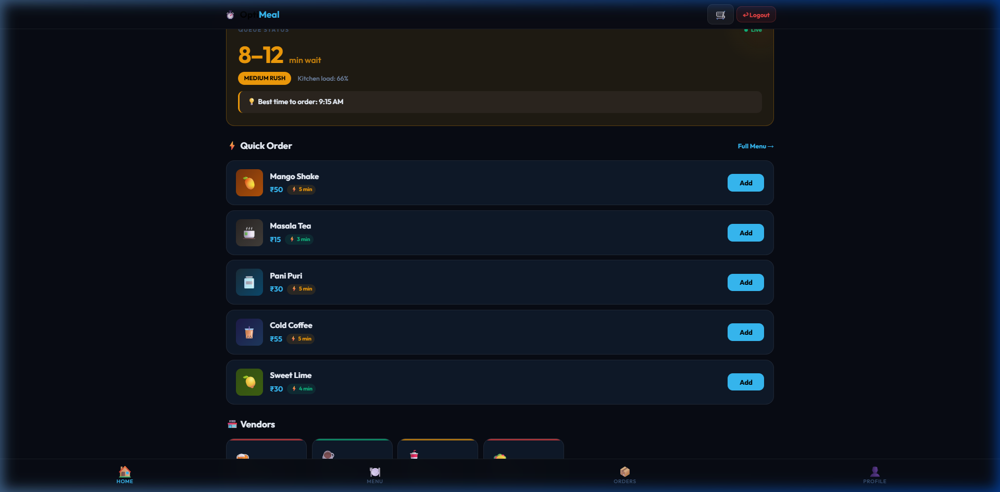
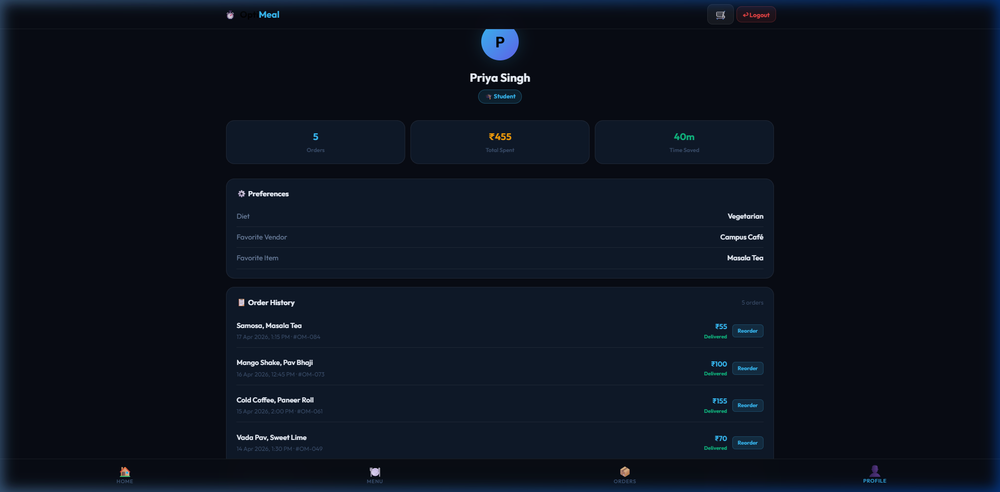
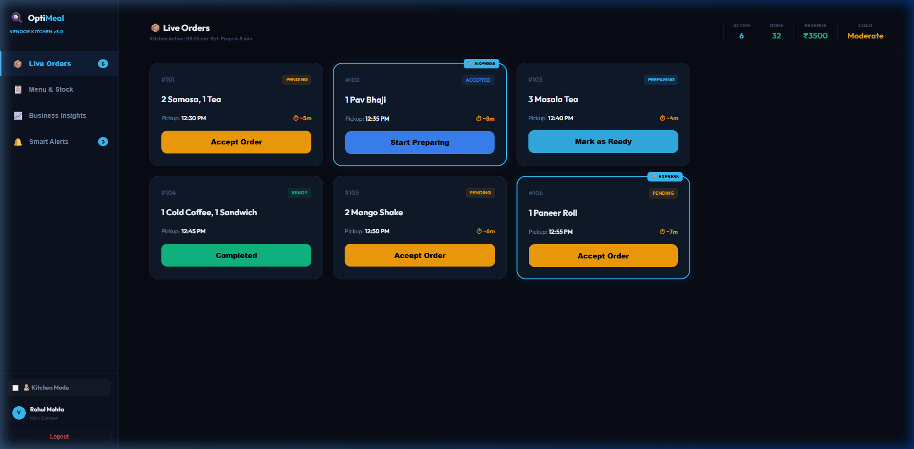
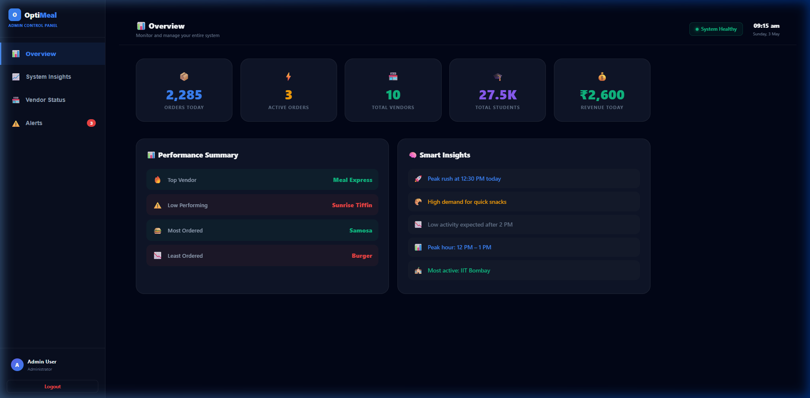

# 🚀 OptiMeal – Smart Queue & Food Optimization System

OptiMeal is a production-style campus food platform designed to solve the chaos of canteen rush hours using real-time queue intelligence and predictive demand planning.

---

## 💡 Problem
Campus canteens suffer from:
* **Long queues** during peak hours (12 PM - 2 PM).
* **Uncertain wait times** causing student frustration.
* **Kitchen overload** leading to delayed orders and poor food quality.
* **Food waste** due to inefficient demand forecasting.

## ✅ Solution
OptiMeal is NOT just a food ordering app; it is a **Real-Time + Predictive Queue Intelligence System** that:
* **Reduces waiting time** for students via live status tracking.
* **Distributes orders** using structured pickup time slots.
* **Helps vendors** handle rush efficiently with a state-based kitchen workflow.
* **Gives admins** full visibility into system health and vendor performance.

---

## 🧠 Key Features

### 🧑‍🎓 Student Experience
* **Queue Status Hero**: Instantly see wait times and rush levels (Low/Medium/High).
* **Predictive Timing**: "Best time to order" suggestions to avoid the peak rush.
* **Quick Ordering**: One-click add-to-cart for popular items.
* **Live Tracking**: Real-time status updates with a countdown timer.
* **⚡ Time Saved Metric**: Celebrates every minute saved by skipping the physical queue.

### 🧑‍🍳 Vendor Dashboard
* **Action-First Interface**: Manage orders through a simple "Accept → Prepare → Ready" flow.
* **Express Order Support**: Visual priority badges for high-speed preparation.
* **Load Analytics**: Real-time kitchen load tracking to manage staff capacity.
* **Menu Management**: Full CRUD capabilities for menu items and stock availability.

### 🛡️ Admin Control Panel
* **System Overview**: 5-second health check covering revenue, orders, and active users.
* **Peak Hour Analysis**: Visual charts showing order distribution throughout the day.
* **Actionable Alerts**: Immediate notifications for system delays or vendor bottlenecks.

---

## 🏗️ Tech Stack
* **Frontend**: React (SPA), Recharts (Analytics), CSS3 (Modern Glassmorphism UI)
* **Backend**: Flask (Python), REST API
* **State Management**: LocalStorage Sync (Demo mode) / Real-time order simulation

---

## 🎯 Core Idea
> **"This is NOT a food ordering app. It is a Queue Optimization System."**
> Our goal is to replace physical queues with digital certainty.

---

## 📸 Screenshots

### Student Home & Queue Status


### Student Order History & Time Saved


### Vendor Kitchen Management


### Admin System Control Panel


---

## 🚀 Future Scope
* **AI Demand Prediction**: Machine learning models to forecast ingredient needs based on historical peaks.
* **Smart Vendor Recommendations**: Suggesting vendors with the lowest wait times to students.
* **Advanced Analytics**: Detailed wastage reporting and revenue optimization tools for vendors.

---

## 👨‍💻 Installation & Setup

1. **Frontend**:
   ```bash
   cd frontend
   npm install
   npm start
   ```

2. **Backend**:
   ```bash
   cd backend
   pip install -r requirements.txt
   python app.py
   ```

---

*Built with ❤️ for Campus Efficiency.*
